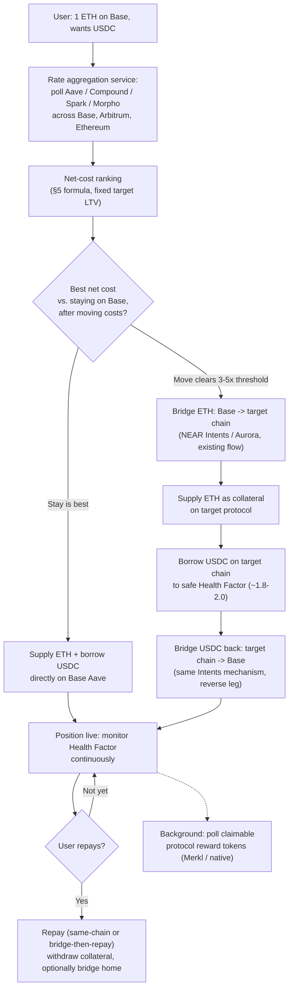

# Best-Rate Borrow — Product & Engineering Scope

**Status:** Draft for engineering scoping · **Author:** Hood product (via Claude) · **Data snapshot:** live rates pulled 2026-09-24, ETH spot ≈ $2,677 (Binance ETHUSDT). All rates in this doc are real, pulled from each protocol's own public API at the time of writing — re-pull before building the simulation into the product, rates move daily.

---

## 1. TL;DR

Today Hood's Borrow panel already does something clever: given a collateral asset, it checks Aave v3 across **every EVM chain Aave is deployed on** and routes the user to whichever chain nets the best supply-minus-borrow rate, using the existing NEAR Intents (Aurora) bridge to move the asset there first if needed. That's implemented in [`src/Borrow.jsx`](../src/Borrow.jsx) today.

This doc scopes the next step: do the same rate-shopping **across protocols, not just across chains of one protocol** — Aave, Compound v3, Spark, and Morpho Blue (Kamino is flagged separately below — it's Solana-only, which changes the architecture completely). Concretely:

> User holds 1 ETH on Base and wants USDC. Instead of naively supplying ETH and borrowing USDC on Base's Aave market, the product checks Aave/Compound/Spark/Morpho across Base, Arbitrum, and Ethereum, computes the **net cost of borrowing** (not just the raw borrow rate — see §5), and either keeps the user on Base or routes them through a bridge to wherever the net cost is actually lowest — but only if the saving clears the cost of moving.

The worked simulation in §8 uses today's real numbers and reaches a genuinely useful, non-obvious conclusion: for a 1 ETH position, the "obviously best" cross-chain route is *not* worth it once bridging/gas costs are netted out, and one of the four protocols (Morpho Blue) is quietly the **worst** option today despite having a competitive headline borrow rate — because of how it pays (or doesn't pay) yield on collateral. That distinction is the crux of why this needs careful engineering, not just "find the lowest borrow APY."

---

## 2. The use case, restated precisely

A user holds an asset (ETH) on one chain (Base) and wants liquidity in another asset (USDC) — **without selling the ETH** (no taxable event in many jurisdictions, no giving up upside exposure). Instead of the obvious "deposit ETH → borrow USDC, same chain, same protocol," the system should:

1. Query supply APY for the collateral asset (ETH) and borrow APY for the target asset (USDC) across every supported protocol × chain combination.
2. Compute the **net annual cost** of borrowing at a safe LTV for each combination (see §5 for why raw APY comparison is wrong).
3. Rank them, factoring in the one-time cost of getting there (bridge fee + destination gas) against the annualized savings.
4. If a different protocol/chain wins net of moving costs: bridge the ETH there (chain A → chain B), supply it as collateral, borrow USDC there, then bridge the borrowed USDC back to the chain the user actually wanted it on (chain B → chain A). If nothing beats staying put, execute locally and skip the bridge entirely — **the optimizer must be willing to conclude "do nothing," not just always pick a winner.**

### Why someone wants this in the first place (real use cases)

- **Hedging a position** — a user long ETH who's nervous about a near-term drop can borrow USDC against it as a partial hedge, rather than selling into weakness and re-buying later (worse tax outcome, market-timing risk).
- **Spending without selling** — Hood already has a crypto card (`src/Card.jsx`, `src/lib/immersve.js`). Borrowing USDC to fund card spend, instead of swapping ETH → USDC to spend, keeps the ETH position intact — this is the single biggest reason people use borrow-against-crypto instead of a simple swap.
- **Bridging cash flow** — "I get paid next week but need $2k now" — borrow against ETH you don't want to touch, repay from the next paycheck, no forced sale at a bad moment.
- **Airdrop / point farming** — some protocols reward borrowers and suppliers with points/tokens for TVL (Morpho's MORPHO rewards, Compound's COMP, historically Aave Merit rewards). A user may deliberately want *exposure to a specific protocol's incentive program* even if the raw net-cost math doesn't fully justify it — this product should surface that reward layer as its own line item (§7), not hide it inside the APY number, so a user can make that call explicitly.

---

## 3. What's already built (baseline to extend, not replace)

- [`src/Borrow.jsx`](../src/Borrow.jsx) already:
  - Queries Aave v3's public GraphQL API (`https://api.v3.aave.com/graphql`) across every EVM chain in `AAVE_CHAINS` (Ethereum, Base, BNB Chain, Polygon, Optimism, Arbitrum, Monad) — see `AAVE_CHAINS`, `fetchAaveMarkets`-equivalent logic and the GraphQL query at line ~136.
  - Already computes a **net cost metric**, not a raw APY comparison: `netCostApy(rate) = ASSUMED_LTV * borrowApy - collateralAsset.supplyApy` (`ASSUMED_LTV = 0.65`), and picks the best chain by sorting on that.
  - Already applies a safety haircut: `safeBorrowAmount = maxBorrowAmount * 0.85` — i.e. targets 85% of the *maximum* borrowable amount at that protocol's max LTV, not a health-factor target per se (see §6 for why this should change).
  - Already executes cross-chain moves via NEAR Intents / Aurora's 1-click swap API (`AURORA_QUOTE_URL` / `AURORA_DEPOSIT_SUBMIT_URL` / `AURORA_STATUS_URL` in [`src/lib/shared.js`](../src/lib/shared.js)) — quote → deposit → poll status pattern.
  - Does **not yet** support: any protocol other than Aave, repayment, withdrawal/unwind, or reward claiming.

This scope adds: Compound v3, Spark, Morpho Blue as additional rate sources (same "find best net cost" ranking, now cross-protocol); repayment; unwind/withdraw; reward claiming; a real health-factor target instead of a flat 85%-of-max heuristic.

---

## 4. Protocol × chain matrix (as of this data pull)

| Protocol | Chains relevant here | Collateral (ETH) earns yield? | Isolated or pooled markets | Notes |
|---|---|---|---|---|
| **Aave v3** | Ethereum, Base, Arbitrum (+ Optimism, Polygon, BNB, Monad already wired) | **Yes** | Pooled per chain | Already integrated. Real-time via public GraphQL, no key needed. |
| **Compound v3 ("Comet")** | Ethereum, Base, Arbitrum | **Yes** (on the "base asset" side; collateral-only assets like WETH in a USDC-base market earn *no* yield — same trap as Morpho, see below, depending on which side ETH is on) | One base asset per deployment ("USDC market", "WETH market", etc.) — **check which market ETH is being supplied into** | Borrow-side rate not available from a free public API in this pass (DefiLlama's borrow endpoint is paid-tier only) — pull live from the Comet contract's `getBorrowRate(utilization)` or Compound's own subgraph at build time. |
| **Spark** | **Ethereum only** — not deployed on Base or Arbitrum as of this pull | Yes | Pooled | A fork of Aave v3's architecture (SparkLend), so likely queryable through a similar GraphQL/subgraph shape — confirm exact endpoint at build time. Because it's L1-only, it's only relevant if the L1 route is already in play for other reasons (see §8 — usually isn't, for small positions). |
| **Morpho Blue** | Ethereum, Base, Arbitrum | **No, by default** — Morpho Blue's isolated markets pay yield only to suppliers of the *loan* asset (USDC here); the *collateral* asset (WETH) earns **0%** sitting in the market. This is a protocol design choice (isolated markets, no rehypothecation of collateral), not a data gap — confirmed via Morpho's own API returning `apyBase: 0` for every WETH-collateral position. | Isolated, many markets per asset pair, each with its own LLTV | Real market example pulled below: the largest WETH/USDC market on Base has 86% LLTV (higher max leverage than Aave's 80%) and a public GraphQL API (`https://blue-api.morpho.org/graphql`, no key). MetaMorpho vaults (auto-allocating supply-side vaults) are a separate product surface, not used for collateral. |
| **Kamino** | **Solana only** | Yes (Solana's Kamino Lend) | Pooled | **Out of scope for v1.** This whole flow assumes an EVM chain → EVM chain bridge (NEAR Intents already handles that). Bridging ETH from an EVM chain into a Solana-native lending market means an entirely different bridge (Wormhole, deBridge, or a Solana-side wrapped-asset route), a different execution/settlement risk profile, and Solana account-model logic. Recommend treating Kamino as a **separate, later scope item**, not folded into this one — the "best net cost across everything" promise would otherwise silently carry very different risk depending on which line won. |

---

## 5. Why "lowest borrow rate" is the wrong metric (net cost formula)

The naive approach — "find the protocol with the lowest USDC borrow APY" — is wrong for two reasons the existing Aave-only code already gets right and this expansion must preserve:

1. **The collateral itself may or may not earn yield**, and that has to be netted against the borrow cost. Aave/Compound(base-asset side)/Spark pay yield on supplied collateral; Morpho Blue isolated markets structurally do not. Ignoring this makes Morpho look artificially competitive on a raw-APY comparison when it's actually not, once netted (see §8's real numbers).
2. **LTV/LLTV differs by protocol** (80% on Aave, 86% on this Morpho market) — a protocol that lets you borrow more against the same collateral changes the absolute dollar cost/benefit even at the same APY, so any comparison must fix a *target LTV* (not necessarily each protocol's max) and compare at that fixed target.

**Formula** (extend the existing `netCostApy`):

```
net_annual_cost(protocol, chain) =
  (collateral_value_usd × target_ltv × borrow_apy)
  − (collateral_value_usd × collateral_supply_apy)   // 0 for Morpho-style isolated markets
  − (collateral_value_usd × target_ltv × reward_apy_on_borrow)   // e.g. Morpho/Compound incentive tokens, priced conservatively
  + (collateral_value_usd × reward_apy_on_supply)                // e.g. Aave Merit-style supply incentives, if any
```

Rank every protocol × chain combination by this number (lower is better), not by raw borrow APY. Reward APYs should be priced at a conservative discount (e.g. 50%) to the current spot value of the reward token, since incentive programs change or end without notice and the token itself may be illiquid — flag reward-inclusive numbers separately from base-rate numbers in the UI so a user can see both.

---

## 6. Health factor — what to actually target

The current code's `safeBorrowAmount = maxBorrowAmount * 0.85` is a reasonable rough safety margin but isn't expressed in the industry-standard unit (**Health Factor**, HF), which is what every protocol's own tooling, alerts, and the user's mental model will use:

```
HF = (collateral_value_usd × liquidation_threshold) / borrowed_value_usd
```

(Aave/Spark call this "liquidation threshold"; Morpho Blue's equivalent is the market's **LLTV** directly, since Morpho doesn't separate max-LTV from liquidation-LTV the way Aave does — in Morpho, LLTV *is* the liquidation threshold.)

**Recommendation:**
- **On open, target HF ≈ 1.8–2.0.** This is meaningfully more conservative than borrowing to 85% of max (which on an 80% max-LTV asset with an ~83% liquidation threshold works out to an HF often close to 1.15–1.2 — uncomfortably tight for a position nobody is actively watching). ETH can move 20%+ in a day; a HF of 1.8–2.0 gives real room before any monitoring/alerting even needs to fire.
- **Monitor continuously.** Warn the user (push/email) at HF < 1.4; treat HF < 1.15 as urgent (repay-or-add-collateral prompt); do not build auto-liquidation-avoidance (auto-repay/auto-top-up) into v1 without a very explicit opt-in and its own security review — that's a feature that moves funds without a fresh user signature each time, which is exactly the kind of thing flagged in the open questions (§10).
- **Recompute HF per protocol correctly**: Aave/Spark expose `healthFactor` directly on the account query; Compound v3's Comet exposes `isLiquidatable(account)` plus the account's collateral/borrow balances (compute HF manually from those); Morpho Blue: `HF = collateral_amount × oracle_price × LLTV / borrowed_amount`.
- Because moving to a *different* chain than the one the user is actively watching is itself a small risk multiplier (a fast market move is easier to miss on a position "over there"), weight the routing decision in §8 to require a **larger** net benefit before recommending a cross-chain move than a same-chain protocol switch — e.g. require the annualized saving to clear the moving cost by 3–5× before recommending a bridge, not just by any positive margin.

---

## 7. Repayment flow

Not implemented yet in the current code — full scope for this addition:

1. **Partial or full repayment**, initiated from either the origin chain (where the user "lives") or the chain the debt actually sits on.
   - **Same-chain repayment** (funds already on the chain with the debt): straightforward `approve` + `repay` (or Comet's `supply` of the base asset, which is how Compound v3 models repayment) call.
   - **Cross-chain repayment** (user has USDC on Base but the debt is on Arbitrum's Morpho market): bridge the repayment amount over first (same NEAR Intents flow used for the original ETH move), then repay. Quote the bridge fee up front so the user sees total repayment cost before confirming.
2. **Interest accrual between quote and execution**: debt grows every block. Either (a) repay a small overpayment (e.g. +0.5%) and refund the dust, or (b) query the exact current debt right before submitting the repay transaction and use `type(uint256).max` for the approval (standard pattern for "repay full balance" across Aave/Compound/Morpho) so the tx succeeds even if a few more seconds of interest accrued.
3. **Full close-out**: after full repayment, withdraw the collateral. If the user wants it back on their original chain, that's a second bridge leg (same mechanism, reverse direction) — quote this too, since for a fully-closed small position the cost of moving collateral back can be a meaningful fraction of any yield earned over the position's life.
4. **UI must show, before repayment is confirmed**: current debt, accrued interest since last update, bridge cost, and (if closing) collateral-withdrawal + bridge-back cost — the same "show total cost before committing" principle as opening.

---

## 8. Worked simulation — 1 ETH on Base, real rates (2026-09-24 snapshot)

**Collateral value:** 1 ETH × $2,677.36 = **$2,677.36**
**Target LTV for this comparison:** 65% (matching the existing `ASSUMED_LTV`, and inside every protocol's max/LLTV below) → **borrow amount held constant at $1,740.28** across all four rows so the comparison is apples-to-apples.

| Option | Collateral supply APY | USDC borrow APY | Max LTV / LLTV | Annual interest paid | Annual collateral yield | **Net annual cost** |
|---|---|---|---|---|---|---|
| **Base — Aave v3** (today's default) | 1.42% | 4.97% | 80% | $86.49 | $38.02 | **$48.47** |
| Arbitrum — Aave v3 | 1.06% | 6.10% | 80% | $106.16 | $28.38 | $77.78 *(worse than Base)* |
| Ethereum — Aave v3 | 1.44% | 4.44% | 80.5% | $77.27 | $38.55 | **$38.72** *(best raw number)* |
| Base — Morpho Blue (WETH/USDC, $98M market) | **0%** | 4.84% | 86% | $84.23 | $0.00 | $84.23 *(worse than Base Aave, despite a lower headline borrow rate)* |

*(Compound v3 and Spark omitted from the ranked table — their borrow-side APYs weren't retrievable from a free public endpoint in this pass; Compound's Base WETH-market supply APY was 1.32% for reference. Pull both live via each protocol's own API/contract before wiring this into the product — see §9.)*

**What this actually shows:**

1. **Morpho Blue's zero collateral yield makes it the worst of the four here**, even though its raw borrow APY (4.84%) looks better than Base Aave's (4.97%). This is precisely the failure mode §5 warns about — a naive "lowest borrow rate wins" ranking would have picked the worst option.
2. **Arbitrum is strictly worse than Base right now** on both legs (lower supply yield *and* higher borrow rate) — there is no reason to move there today, contradicting the intuition in the original brief that Arbitrum/Morpho would be the winner. Rates move daily; this is exactly why the ranking has to be computed live, not assumed.
3. **Ethereum mainnet Aave has the best raw net cost** ($38.72/yr vs Base's $48.47/yr — a $9.75/yr improvement). But: moving 1 ETH collateral to Ethereum L1, and later moving the borrowed USDC back to Base, means **two L1-touching legs** (or one, if the user is fine holding/spending the USDC on Ethereum directly). At typical 2026 gas conditions, a supply+borrow transaction pair on Ethereum L1 plus the bridge fee for getting the ETH there in the first place will very plausibly cost **$15–$60+** depending on gas price at execution time — which can exceed the entire *annual* saving being chased. **Recommendation validated: the router should refuse to recommend an L1 destination for a position this size unless the saving is large enough or the position will be held long enough to amortize the one-time cost** — this is the concrete case for the "require 3–5× the moving cost in savings" rule in §6.
4. **Net-net for this exact snapshot: staying on Base is the right call**, or at most a same-L2 comparison (Base vs. Arbitrum, both cheap to move between) — which today still favors staying on Base. The product should be able to say "no move is worth it right now" as a first-class answer, not just always route somewhere.

This table should be regenerated with live numbers as part of building the rate-aggregation service (§9) — treat the numbers above as *proof the model produces a real, non-obvious, checkable answer*, not as a fixed table to hardcode.

---

## 9. Rate aggregation — data sources

| Source | Auth | Gives | Example query used for this doc |
|---|---|---|---|
| Aave v3 public GraphQL — `https://api.v3.aave.com/graphql` | None | Supply/borrow APY, max LTV, per chain, per reserve — already used in `src/Borrow.jsx` | `{ markets(request: { chainIds: [8453, 42161, 1] }) { reserves { underlyingToken { symbol } supplyInfo { apy { formatted } maxLTV { value } } borrowInfo { apy { formatted } borrowingState } } } }` |
| Morpho Blue public GraphQL — `https://blue-api.morpho.org/graphql` | None | Per-market supply/borrow APY, LLTV, TVL, for every isolated market | `{ markets(first: 100, where: { chainId_in: [8453, 42161] }, orderBy: SupplyAssetsUsd, orderDirection: Desc) { items { loanAsset { symbol } collateralAsset { symbol } lltv state { supplyApy borrowApy supplyAssetsUsd borrowAssetsUsd } } } }` — filter client-side for the collateral/loan pair you want. |
| Compound v3 ("Comet") | — | Supply-side APY is on DefiLlama's free `/pools` endpoint (`project: "compound-v3"`); **borrow-side is not** on the free tier. Pull it live from the Comet contract's `getBorrowRate(getUtilization())` view function per deployment, or from Compound's own subgraph/API (confirm current endpoint — it changed since this doc was drafted; check `docs.compound.finance` at build time). |
| Spark (SparkLend) | — | DefiLlama free `/pools` has Ethereum-only supply APY (`project: "sparklend"`). Confirm current API for borrow-side and whether Spark has expanded beyond Ethereum by build time — the "Spark Liquidity Layer" cross-chain expansion has been an active area for this protocol and may have changed the chain list in §4. |
| DefiLlama `https://yields.llama.fi/pools` | None | Broad supply-side APY coverage across all of the above for sanity-checking / fallback, TVL for liquidity-depth checks | Used above to confirm which chains each protocol is actually deployed on. |
| Binance `https://api.binance.com/api/v3/ticker/price` | None | Spot price for collateral-value-in-USD math | Already the pattern used elsewhere in this codebase (see `src/Duel.jsx`) for a live price feed with no key and generous rate limits. |

**Polling cadence recommendation:** rates move slowly enough that polling every 2–5 minutes per protocol/chain is plenty for ranking purposes; cache aggressively and only re-quote the exact numbers right before a user actually commits to a route (rates *and* liquidity can both move between "here's the best option" and "confirm").

---

## 10. Claiming incentive rewards

Distinct from the base supply/borrow APY, several of these protocols run token-incentive programs on top:

- **Morpho**: MORPHO token incentives on many markets, distributed off-chain and claimed on-chain via **Merkl** (`https://merkl.xyz`, API at `api.merkl.xyz`) — a universal rewards distributor pattern: periodically fetch the user's claimable proof from Merkl's API, submit it to Merkl's on-chain distributor contract to claim. Confirm current API paths at build time (Merkl's API has evolved).
- **Compound v3**: native COMP rewards on some Comet deployments, claimable via the Comet contract's own `getRewardOwed(cometAddress, account)` / `claim(...)` pattern (Compound's "CometRewards" contract) — no external indexer needed, it's fully on-chain.
- **Aave**: has run various incentive programs (stkAAVE emissions historically, "Merit" rewards more recently on specific markets) — claimable through Aave's rewards controller contract; check per-market whether an active program exists (`rewardTokens` field is visible in the DefiLlama pool data used above as a quick signal).
- **Spark**: has distributed SPK token incentives on specific markets — check current program status/contract at build time.

**Product implication**: surface "+ X% in token rewards (est.)" as a clearly-separated second line under the base APY, never blended into the headline number (reward token prices and program terms both change), and build a periodic background job per protocol to fetch claimable amounts so the user sees "you have $Y in unclaimed rewards" without needing to check each protocol's own site.

---

## 11. Execution flow (end to end)



---

## 12. Developer task breakdown

1. **Rate aggregation service** — generalize the existing Aave-only fetch in `src/Borrow.jsx` into a protocol-agnostic adapter interface (`getSupplyApy`, `getBorrowApy`, `getMaxLtvOrLltv`, `getRewardApy`) with one implementation per protocol (Aave adapter mostly already exists; Morpho Blue adapter is new but has a working query above; Compound/Spark need their borrow-side data source confirmed first).
2. **Net-cost ranking engine** — implement the §5 formula against the adapter interface's normalized output; unit-test against the §8 numbers as a golden-value check.
3. **Route planner** — decides stay-vs-move using the §6 threshold rule; produces a full cost preview (bridge fee, destination gas estimate, net annual benefit) *before* any transaction is signed.
4. **Execution orchestrator** — a multi-step, resumable state machine (approve → bridge → supply → borrow → bridge-back), since this spans multiple chains and can take minutes; needs to survive the user closing the tab mid-flow and resuming, and to handle a step failing partway (e.g. bridge succeeds but the destination-chain supply tx fails — don't strand funds on the wrong chain silently).
5. **Health factor monitor** — background job recomputing HF per open position per protocol's own formula (§6), alerting at the two thresholds.
6. **Repayment + unwind flow** — per §7, both same-chain and cross-chain repayment paths, full-balance-safe repay pattern.
7. **Reward claim job** — per §10, one job per protocol with an active incentive program, surfaced as its own UI line item.

---

## 13. Open questions for the team

- **Kamino/Solana**: separate scope item or not at all for v1? (Recommend: not for v1 — see §4.)
- **Auto-rebalancing**: once opened, should the product ever move an existing position to a newer better-rate opportunity automatically, or only on open? Rebalancing has its own bridge+gas cost each time, so it needs the same 3–5× threshold logic as opening — and doing it automatically means holding some kind of standing authorization to move user funds without a fresh signature each time, which is a real custody/security question, not just an engineering one.
- **Custody model for repeated actions**: does every step (bridge, supply, borrow, repay, claim) require a fresh wallet signature (safest, most friction), or does the product hold a session key / smart-account permission for the multi-step flow (smoother UX, meaningfully larger attack surface if that key or permission is ever compromised)? This is the same class of question flagged for the Last Dance game project's real-money plan — worth solving once, consistently, across both products rather than twice.
- **Audit posture**: Aave v3, Compound v3, Spark, and Morpho Blue are all long-running, heavily audited, blue-chip protocols with real TVL — the base protocol risk here is about as low as DeFi lending gets. The residual risk is almost entirely in *this product's own* orchestration code (approvals, the multi-step state machine, bridge integration) — that's what actually needs a security review before real funds flow through it.
